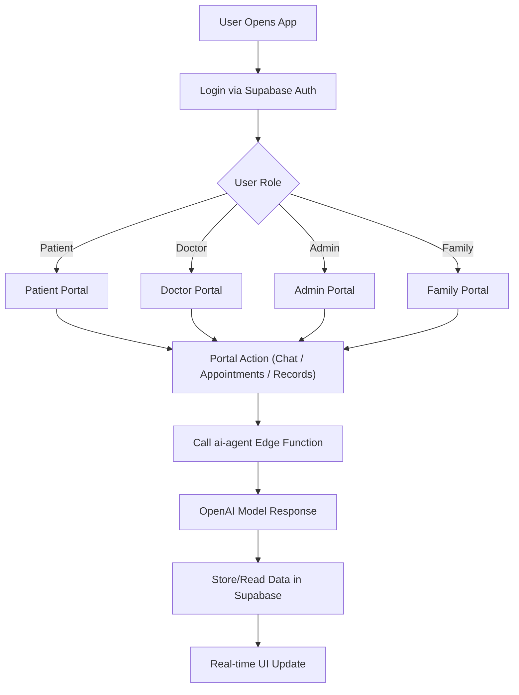

# 🏥 Medical Online Consultant Hospital (MedFlow AI)

MedFlow AI is a state-of-the-art, AI-driven healthcare management platform designed to revolutionize the clinical experience. It provides distinct, context-aware portals for **Patients**, **Doctors**, **Hospital Administrators**, and **Family Members**, all unified by a powerful multi-agent AI ecosystem.

---

## 👤 Project Owner

- **Name**: Macharla Naga Manoj Reddy
- **GitHub**: [MacharlaNagamanojreddy](https://github.com/MacharlaNagamanojreddy)
- **Repository**: [Medical-online-consultant-Hospital](https://github.com/MacharlaNagamanojreddy/Medical-online-consultant-Hospital)

---

## 🌟 Key Highlights

- **Multi-Agent Architecture**: Discrete AI agents tailored for clinical, administrative, and patient support roles.
- **Real-Time Integration**: Built on Supabase for instant data synchronization across all user portals.
- **Premium Design Logic**: High-contrast dark medical theme with fluid animations and responsive layouts.
- **Predictive Intelligence**: AI-powered features like Predictive Discharge and Automated Clinical Summaries.

## 📖 Build History & Walkthroughs

The project was developed over a 5-day intensive build. You can explore the detailed evolution here:

- [📅 Day 1: Database & AI Foundation](./docs/walkthroughs/day1.md)
- [📅 Day 2: Patient Agent & Appointments](./docs/walkthroughs/day2.md)
- [📅 Day 3: Doctor Agent & Clinical SOAP Notes](./docs/walkthroughs/day3.md)
- [📅 Day 4: Hospital & Family Ecosystem](./docs/walkthroughs/day4.md)
- [📅 Day 5: Premium UI & Final Integration](./docs/walkthroughs/day5.md)

---

## 🤖 AI Agent Ecosystem

MedFlow AI leverages a sophisticated `ai-agent` edge function (implemented with Claude 3.5 Sonnet) that powers specialized behavior for each role:

- **Clinical Agent**: Assists doctors with SOAP note generation, patient briefings, and diagnostic suggestions.
- **Patient Agent**: Provides 24/7 symptom triage, medication reminders, and general health question answering.
- **Admin Agent**: Analyzes hospital data for predictive discharge trends and resource optimization.
- **Family Agent**: Translates complex medical jargon into plain language for clear family updates.

---

## 🖥️ Portals & Features

### 🩺 Doctor Portal (The Clinical Hub)
- **AI SOAP Note Generator**: Converts raw clinical notes into professional, structured records automatically.
- **Intelligent Briefing Cards**: Provides a concise AI-generated summary of a patient's entire history before a consultation.
- **Smart Patient Queue**: Real-time tracking of patient status with visual urgency markers.
- **E-Prescribing & Labs**: Integrated order management for medications and diagnostic tests.

### 👤 Patient Portal (The Personal Health Companion)
- **AI Health Bot**: A WhatsApp-style interface for instant health questions and clinical support.
- **Smart Appointments**: Intelligent scheduling with specialty-based doctor matching.
- **Health Snapshot**: Real-time vital monitoring and active medication tracking.
- **Secure Records**: One-tap access to labs, imaging, and past clinical summaries.

### 🏢 Admin Portal (The Hospital Command Center)
- **Predictive Bed Management**: Visual grid of all hospital beds with AI-driven discharge predictions.
- **Operational Insights**: Real-time analytics on admissions, occupancy rates, and staff efficiency.
- **Staff Rostering**: Unified scheduling system with role-based filters (Nurses, MDs, Admins).
- **Billing Intelligence**: Overview of financial operations and billing cycles.

### 👨‍👩‍👧 Family Portal (The Care Circle)
- **Plain-Language Updates**: AI-powered "translation" of clinical statuses into clear, jargon-free updates for family members.
- **Visit Scheduling**: Seamless coordination of hospital visits aligned with facility policies.
- **Direct Care-Line**: Secure communication channel for administrative or general inquiries.

---

## 🛠️ Technology Stack

- **Frontend**: `Vite`, `React 18`, `TypeScript`
- **Styling**: `Tailwind CSS`, `Shadcn UI`, `Lucide Icons`, `Framer Motion`
- **Backend**: `Supabase` (Auth, PostgreSQL, Realtime)
- **AI Microservices**: `Supabase Edge Functions` + `Claude 3.5 Sonnet` / `GPT-4o`
- **Data Fetching**: `React Query` (TanStack Query)
- **Navigation**: `React Router v6`

---

## 🚀 Local Development

1. **Prerequisites**: Ensure you have [Node.js](https://nodejs.org/) installed.
2. **Clone & Install**:
   ```bash
   git clone https://github.com/MacharlaNagamanojreddy/Medical-online-consultant-Hospital.git
   cd Medical-online-consultant-Hospital
   npm install
   ```
3. **Environment Setup**:
   - Create a `.env` file in the root directory.
   - Add your credentials:
     ```env
     VITE_SUPABASE_URL=your_supabase_url
     VITE_SUPABASE_PUBLISHABLE_KEY=your_supabase_publishable_key
     ```
4. **Run the App**:
   ```bash
   npm run dev
   ```

---

## 🔁 Workflow Diagram



---

## ✅ Final Project Status: 100% COMPLETED
All milestones from the 5-day roadmap have been successfully implemented, verified, and polished. MedFlow AI is ready for demonstration.

---

## 👤 Owner Details

Name: Macharla Naga Manoj Reddy  
GitHub: MacharlaNagamanojreddy  
Repository: Medical-online-consultant-Hospital
